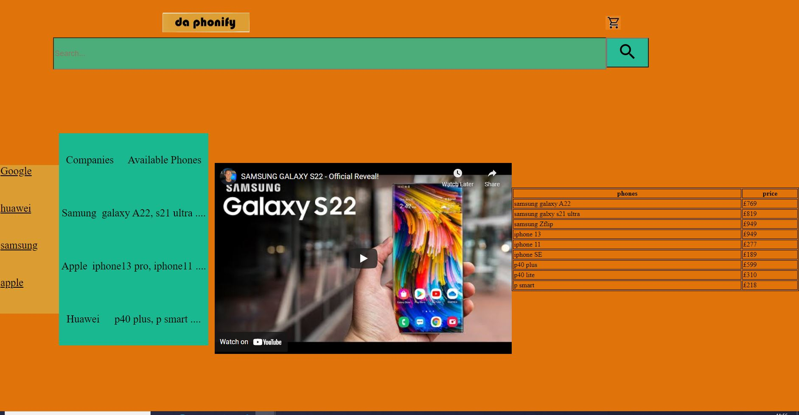
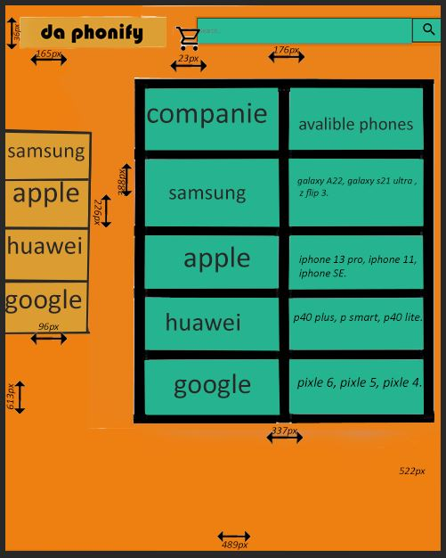
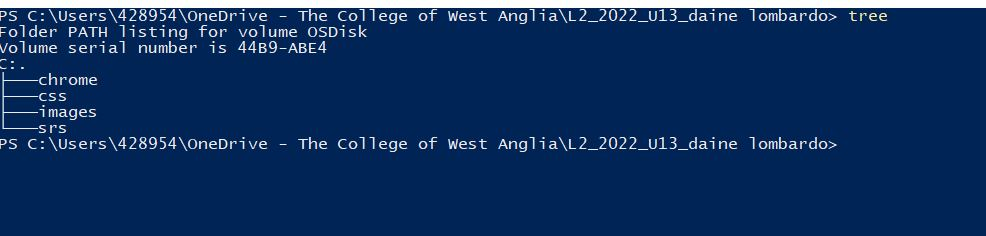
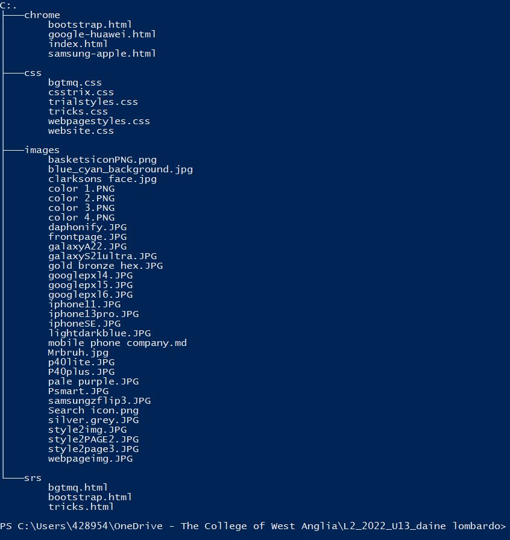
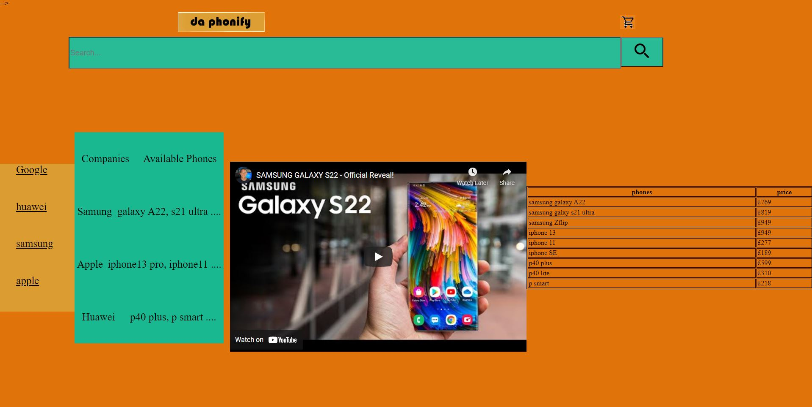
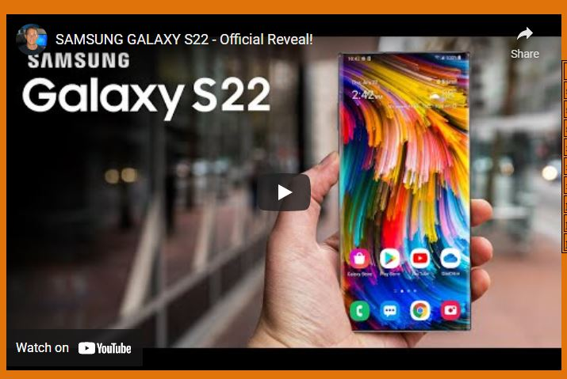
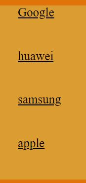

# mobile phone reatail company
# who are the stakeholders 
this catogory usally has three types of stakeholders to be spercific, customers who buy phone's from a phone company are usally 40 to 50 year old women proberly buying for their children. these are properly listed below.  
# Customers
* product information- so that know what they're bying 
* easily accessable- so they can easly locate the compsany website  
* simple (easy to navagate) so they can locate the product they want  
* quick loading- so the customer does'nt wait ages, get bored and move on to another website 
# Owners
* needs to look good- so people actually want to buy the product  
* profestional- so it gets recognised as a good retail business  
* generate business- so business is mad fast 
* cheap- so any unwanted payments to the developers are made  
# Developers 
* well documented- so its nice and organised  
* maintainable- so if complications do occour they're easily fixed  
* quick and easy to implement- easy to make changes 
* easy to test 
* flowing standards 
# color scheme 
##### palette URL:https://paletton.com/#uid=14E0u0k6hCh0LWL2+NOawtWfLoQ
  
##### palette URL:https://paletton.com/#uid=10I0u0k17pe06NJ0xuT26kn40fJ

##### palette URL:https://paletton.com/#uid=13L0u0kpdFtFBhlFBhlsO++sO++

i these theree colors because i think they will look great togeather in one webpage 
# images used 
# SAMSUNG 
##### z flip 3 URL:https://www.google.com/search?q=galaxy+z+flip3+5g&rlz=1C1GCEA_enGB972GB973&source=lnms&tbm=isch&sa=X&ved=2ahUKEwjyk9jij8r1AhXNQkEAHcf5CUUQ_AUoA3oECAEQBQ&biw=1920&bih=969&dpr=1&safe=active&ssui=on#imgrc=KmniNbxMGEltWM 
 
##### galazyA22 URL: https://www.google.com/search?q=galaxy+a22&tbm=isch&ved=2ahUKEwiWuMvkj8r1AhVPM8AKHd5kDfcQ2-cCegQIABAA&oq=galaxy+A22&gs_lcp=CgNpbWcQARgAMgUIABCABDIFCAAQgAQyBQgAEIAEMgUIABCABDIFCAAQgAQyBQgAEIAEMgUIABCABDIFCAAQgAQyBQgAEIAEMgUIABCABDoGCAAQCBAeOgQIABAYOgYIABAKEBg6CAgAEIAEELEDUMsSWOUyYMI5aABwAHgAgAE2iAHvAZIBATWYAQCgAQGqAQtnd3Mtd2l6LWltZ8ABAQ&sclient=img&ei=3nfuYZbRLs_mgAbeybW4Dw&bih=969&biw=1920&rlz=1C1GCEA_enGB972GB973&safe=active&ssui=on#imgrc=BjkE94e7DqyK2M 
 
##### galazyS21ultra URL:https://www.google.com/search?q=galaxy+s21+ultra&tbm=isch&ved=2ahUKEwj7qN-dkcr1AhVMYfEDHXQ5AAYQ2-cCegQIABAA&oq=galaxy+s21+ulk&gs_lcp=CgNpbWcQARgAMgYIABAKEBg6BAgAEEM6BQgAEIAEOggIABCABBCxAzoKCAAQsQMQgwEQQzoLCAAQgAQQsQMQgwFQkwZY3llg7m9oB3AAeAGAATmIAYgHkgECMTmYAQCgAQGqAQtnd3Mtd2l6LWltZ7ABAMABAQ&sclient=img&ei=Y3nuYbvrA8zCxc8P9PKAMA&bih=969&biw=1920&rlz=1C1GCEA_enGB972GB973&safe=active&ssui=on#imgrc=0MbrnC5C5avxsM 
 
# APPLE 
##### iphone 13 pro URL: https://www.google.com/search?q=iphone+13+pro&rlz=1C1GCEA_enGB972GB973&source=lnms&tbm=isch&sa=X&ved=2ahUKEwi3uonik8r1AhWJTcAKHfhjAXUQ_AUoAnoECAIQBA&biw=1920&bih=969&dpr=1&safe=active&ssui=on#imgrc=_5teDp9s-n_FhM
 
##### iphone11 URL:https://www.google.com/search?q=iphone+11&tbm=isch&ved=2ahUKEwiks-Lik8r1AhVaXvEDHWVbCvIQ2-cCegQIABAA&oq=iphone+&gs_lcp=CgNpbWcQARgGMgoIABCxAxCDARBDMgoIABCxAxCDARBDMgQIABBDMggIABCABBCxAzIECAAQQzIECAAQQzIICAAQgAQQsQMyCAgAEIAEELEDMggIABCABBCxAzIICAAQgAQQsQM6BAgAEANQwhBYmBZghSNoAHAAeACAATiIAZ4BkgEBM5gBAKABAaoBC2d3cy13aXotaW1nwAEB&sclient=img&ei=DHzuYaT9Kdq8xc8P5bapkA8&bih=969&biw=1920&rlz=1C1GCEA_enGB972GB973&safe=active&ssui=on#imgrc=OhOM4QNHCda9YM

#### iphoneSE URL:https://www.google.com/search?q=iphone+se&tbm=isch&ved=2ahUKEwjC5Ym-lMr1AhX3aPEDHdqPBQ4Q2-cCegQIABAA&oq=iphone+se&gs_lcp=CgNpbWcQAzIICAAQgAQQsQMyCAgAEIAEELEDMgUIABCABDIICAAQgAQQsQMyBQgAEIAEMggIABCABBCxAzIFCAAQgAQyBQgAEIAEMgUIABCABDIFCAAQgAQ6BwgAELEDEEM6BAgAEEM6CwgAEIAEELEDEIMBUKcGWIARYM4VaABwAHgAgAE1iAH-AZIBATWYAQCgAQGqAQtnd3Mtd2l6LWltZ8ABAQ&sclient=img&ei=zHzuYcLPCvfRxc8P2p-WcA&bih=969&biw=1920&rlz=1C1GCEA_enGB972GB973&safe=active&ssui=on#imgrc=7g_C-C7lw7HAoM
 
# HUAWEI 
##### huawei p40 plus URL:https://www.google.com/search?q=p40+pro+plus&tbm=isch&ved=2ahUKEwjn39P1lcr1AhWYVPEDHW8mA6EQ2-cCegQIABAA&oq=P40+pro+&gs_lcp=CgNpbWcQARgAMgQIABBDMgQIABBDMgUIABCABDIFCAAQgAQyBQgAEIAEMgUIABCABDIFCAAQgAQyBQgAEIAEMgUIABCABDIFCAAQgAQ6BwgAELEDEEM6CggAELEDEIMBEEM6CAgAEIAEELEDOgsIABCABBCxAxCDAToICAAQsQMQgwE6CAgAEAUQChAeOgYIABAKEBg6BAgAEBhQ1AlYlIIBYLCOAWgFcAB4AIABOogB9wOSAQIxMJgBAKABAaoBC2d3cy13aXotaW1nsAEAwAEB&sclient=img&ei=TX7uYaeFCpipxc8P78yMiAo&bih=969&biw=1920&rlz=1C1GCEA_enGB972GB973&safe=active&ssui=on#imgrc=XQ_TkjGLz-lx_M 

##### psmart URL:https://www.google.com/search?q=psmart+&tbm=isch&ved=2ahUKEwiItYjXl8r1AhWsYfEDHRIHBicQ2-cCegQIABAA&oq=psmart+&gs_lcp=CgNpbWcQAzIFCAAQgAQyBQgAEIAEMgUIABCABDIFCAAQgAQyBQgAEIAEMgUIABCABDIFCAAQgAQyBQgAEIAEMgUIABCABDIFCAAQgAQ6BAgAEEM6BggAEAcQHjoICAAQCBAHEB5Qow9YlzlgvjtoAHAAeACAATuIAbcDkgEBOZgBAKABAaoBC2d3cy13aXotaW1nwAEB&sclient=img&ei=JYDuYciONqzDxc8Pko6YuAI&bih=969&biw=1920&rlz=1C1GCEA_enGB972GB973&safe=active&ssui=on#imgrc=uRyjLOd_8ugOpM
 
##### p40 lite URL:https://www.google.com/search?q=p40+lite&tbm=isch&rlz=1C1GCEA_enGB972GB973&hl=en-US&sa=X&ved=2ahUKEwjig6iKmsr1AhUwYPEDHSWzBwMQBXoECAEQPw&biw=1903&bih=969&safe=active&ssui=on#imgrc=YrSMsyQ-tYp-sM

# GOOGLE 
##### google pixle 4 URL: https://www.google.com/search?q=google+pixel+4&tbm=isch&ved=2ahUKEwiq9rSLmsr1AhVCXvEDHXeJCo4Q2-cCegQIABAA&oq=google+&gs_lcp=CgNpbWcQARgBMgQIABBDMgQIABBDMgQIABBDMgQIABBDMgQIABBDMgoIABCxAxCDARBDMgcIABCxAxBDMgcIABCxAxBDMggIABCABBCxAzIECAAQQzoFCAAQgAQ6CAgAELEDEIMBUMUGWNtEYNeNAWgMcAB4AIABaYgBlwSSAQM4LjGYAQCgAQGqAQtnd3Mtd2l6LWltZ7ABAMABAQ&sclient=img&ei=rILuYarwIMK8xc8P95Kq8Ag&bih=969&biw=1903&rlz=1C1GCEA_enGB972GB973&hl=en-US&safe=active&ssui=on#imgrc=CxpW0uzTon4SZM&imgdii=JlQ7YfxDt0BXNM
 
##### google pixle 5 URL: https://cdn.dxomark.com/wp-content/uploads/medias/post-60399/google_pixel_5_frontback.jpeg 
 
##### google pixle 6 URL:http://media.4rgos.it/s/Argos/1171134_R_SET?$Main768$&w=620&h=620
  
 with each company i chose, i picked out 3 different phones from each of them and will use them in my webpage ive saved the links of each to comply with copyright.

style 1 
  
 

H= homepage
S= samsung 
A= apple
H= huawei 
G= google
C= checkout 

 |   | H  | S  | A  | H  |  G |  
|---|---|---|---|---|---|---|
| H  | &check;  | &check;  |  &check; | &check;  | &check;  
&check;  |
| S  | &check;  |  |   |   |   |   
| A  | &check;  |   |  |   |   |   
| H  |  &check; |   |   |   |   |   
| G  | &check;  |   |   |   |   |   
 

style 2 
https://paletton.com/#uid=10S0u0koQruffBkkku7s8mJvGhW 

 
  

|   | H  | S  | A  | H  |  G |  |
|---|---|---|---|---|---|---|
| H  | &check;  | &check;  |  &check; | &check;  | &check;  | &check;  |
| S  | &check;  |  |   |   |   |   
| A  | &check;  |   |  |   |   |   
| H  |  &check; |   |   |   |   |   
| G  | &check;  |   |   |   |   |   

 

the style for my web site i have chosen is style two. 
during the production of my webpage i made a few changes, also i added a video on the front page, the things i changed were the colour of the background i changed it from boring white to orange i decided to add a table in made with the help from W3schools i changed the coloutr of the search bar and search icon to a terquise/ blue.As you can see from the images above there are some major diferences like the second table the layout and the youtube video that i added..  
# webpage comparison
this is the URL to my website comparison: 
### https://sway.office.com/NtVz2VpChtU5QPOi 
 
# file structure 

# test plan 
my target audience for my webpage is anyone of the age to buy a mobile phone e.g. teenagers or parents. 

the requirments needed for the wepage are a working navagation system, a table with content a peice of media with relevance to the webpage (interactive content), it should have some sort of typeography and images of products. 

the test that will be carried out will consist of the checking of each link that i added in the bar on the left, it will also consist of checking wether th youtube videpo i added works well and that my colour scheme meets what people like.

i will also will checking the consistencey of the flow in the website and how well it looks. 
# justifying the design
  

i went for this design because i think the colours have a strange contrast but i also think it looks nice. the colours were  an alternative route to what i planed, i chose them mainly because during the process of creating the page i thought these were better than what i origanally thought about using.As you can see from the images above there are some major diferences like the second table the layout and the youtube video that i added which was needed for the webpage.  
# testing 

this is my search bar and it is a functonal part of the wbpage to a certain extent, for exampe what you search in it wont redirect you to the page you want but you still can type in it.and over all it looks great. 

### https://youtu.be/oPR_LU5YNeo
This is a youtube clip of the samsung galaxy s22 offical reveal clip, it is a very good peice to the webpage mainly because it is functonal as in you can play, puse, share and switch between full screen and normal screen easily overall a decent additon. 
  
this is a section i added because i thought it would be the most easiest and funconal way of navagation to get to one place to another and it does function as i wanted.  
# feedback 
luke:said "it looks good, the colors are nice its funconal and easy to navagate however on the other pages i would add a back button" 
patryk:said "its funconal, looks good and the colours work well howerver i would change the fact that when you change the page size the table moves over the video" 
ugnius:said"it looks good is funconal and easily navagated however the phones on each of their pages needs information bellow them". 

based on my feedback i decided to add information underneith the samsung and iphone images, i have rejected the table movment issue because it require to much coding to get done before the deadline of this unit. 