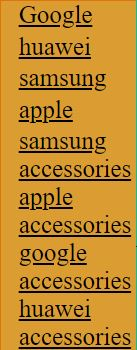

# mobile phone reatail company
# who are the stakeholders 
this catogory usally has three types of stakeholders to be spercific, customers who buy phone's from a phone company are usally 18 to 50 year old women proberly buying for their children. these are properly listed below.  
# Customers
* product information- so that know what they're bying 
* easily accessable- so they can easly locate the compsany website  
* simple (easy to navagate) so they can locate the product they want  
* quick loading- so the customer does'nt wait ages, get bored and move on to another website 
# Owners
* needs to look good- so people actually want to buy the product  
* profestional- so it gets recognised as a good retail business  
* generate business- so business is mad fast 
* cheap- so any unwanted payments to the developers are made  
# Developers 
* well documented- so its nice and organised  
* maintainable- so if complications do occour they're easily fixed  
* quick and easy to implement- easy to make changes 
* easy to test 
* flowing standards 
# task1 
 link to webpage comparison. 
## https://sway.office.com/NtVz2VpChtU5QPOi?ref=Link
# color scheme and typograpy 
##### palette URL:https://paletton.com/#uid=13L0u0kpdFtFBhlFBhlsO++sO++

# images used 
# SAMSUNG 

##### z flip 3 URL:https://www.google.com/search?q=galaxy+z+flip3+5g&rlz=1C1GCEA_enGB972GB973&source=lnms&tbm=isch&sa=X&ved=2ahUKEwjyk9jij8r1AhXNQkEAHcf5CUUQ_AUoA3oECAEQBQ&biw=1920&bih=969&dpr=1&safe=active&ssui=on#imgrc=KmniNbxMGEltWM 

##### galazyA22 URL: https://www.google.com/search?q=galaxy+a22&tbm=isch&ved=2ahUKEwiWuMvkj8r1AhVPM8AKHd5kDfcQ2-cCegQIABAA&oq=galaxy+A22&gs_lcp=CgNpbWcQARgAMgUIABCABDIFCAAQgAQyBQgAEIAEMgUIABCABDIFCAAQgAQyBQgAEIAEMgUIABCABDIFCAAQgAQyBQgAEIAEMgUIABCABDoGCAAQCBAeOgQIABAYOgYIABAKEBg6CAgAEIAEELEDUMsSWOUyYMI5aABwAHgAgAE2iAHvAZIBATWYAQCgAQGqAQtnd3Mtd2l6LWltZ8ABAQ&sclient=img&ei=3nfuYZbRLs_mgAbeybW4Dw&bih=969&biw=1920&rlz=1C1GCEA_enGB972GB973&safe=active&ssui=on#imgrc=BjkE94e7DqyK2M 
 
##### galazyS21ultra URL:https://www.google.com/search?q=galaxy+s21+ultra&tbm=isch&ved=2ahUKEwj7qN-dkcr1AhVMYfEDHXQ5AAYQ2-cCegQIABAA&oq=galaxy+s21+ulk&gs_lcp=CgNpbWcQARgAMgYIABAKEBg6BAgAEEM6BQgAEIAEOggIABCABBCxAzoKCAAQsQMQgwEQQzoLCAAQgAQQsQMQgwFQkwZY3llg7m9oB3AAeAGAATmIAYgHkgECMTmYAQCgAQGqAQtnd3Mtd2l6LWltZ7ABAMABAQ&sclient=img&ei=Y3nuYbvrA8zCxc8P9PKAMA&bih=969&biw=1920&rlz=1C1GCEA_enGB972GB973&safe=active&ssui=on#imgrc=0MbrnC5C5avxsM 
 
# APPLE 
##### iphone 13 pro URL: https://www.google.com/search?q=iphone+13+pro&rlz=1C1GCEA_enGB972GB973&source=lnms&tbm=isch&sa=X&ved=2ahUKEwi3uonik8r1AhWJTcAKHfhjAXUQ_AUoAnoECAIQBA&biw=1920&bih=969&dpr=1&safe=active&ssui=on#imgrc=_5teDp9s-n_FhM
 
##### iphone11 URL:https://www.google.com/search?q=iphone+11&tbm=isch&ved=2ahUKEwiks-Lik8r1AhVaXvEDHWVbCvIQ2-cCegQIABAA&oq=iphone+&gs_lcp=CgNpbWcQARgGMgoIABCxAxCDARBDMgoIABCxAxCDARBDMgQIABBDMggIABCABBCxAzIECAAQQzIECAAQQzIICAAQgAQQsQMyCAgAEIAEELEDMggIABCABBCxAzIICAAQgAQQsQM6BAgAEANQwhBYmBZghSNoAHAAeACAATiIAZ4BkgEBM5gBAKABAaoBC2d3cy13aXotaW1nwAEB&sclient=img&ei=DHzuYaT9Kdq8xc8P5bapkA8&bih=969&biw=1920&rlz=1C1GCEA_enGB972GB973&safe=active&ssui=on#imgrc=OhOM4QNHCda9YM

#### iphoneSE URL:https://www.google.com/search?q=iphone+se&tbm=isch&ved=2ahUKEwjC5Ym-lMr1AhX3aPEDHdqPBQ4Q2-cCegQIABAA&oq=iphone+se&gs_lcp=CgNpbWcQAzIICAAQgAQQsQMyCAgAEIAEELEDMgUIABCABDIICAAQgAQQsQMyBQgAEIAEMggIABCABBCxAzIFCAAQgAQyBQgAEIAEMgUIABCABDIFCAAQgAQ6BwgAELEDEEM6BAgAEEM6CwgAEIAEELEDEIMBUKcGWIARYM4VaABwAHgAgAE1iAH-AZIBATWYAQCgAQGqAQtnd3Mtd2l6LWltZ8ABAQ&sclient=img&ei=zHzuYcLPCvfRxc8P2p-WcA&bih=969&biw=1920&rlz=1C1GCEA_enGB972GB973&safe=active&ssui=on#imgrc=7g_C-C7lw7HAoM
 
# HUAWEI 
##### huawei p40 plus URL:https://www.google.com/search?q=p40+pro+plus&tbm=isch&ved=2ahUKEwjn39P1lcr1AhWYVPEDHW8mA6EQ2-cCegQIABAA&oq=P40+pro+&gs_lcp=CgNpbWcQARgAMgQIABBDMgQIABBDMgUIABCABDIFCAAQgAQyBQgAEIAEMgUIABCABDIFCAAQgAQyBQgAEIAEMgUIABCABDIFCAAQgAQ6BwgAELEDEEM6CggAELEDEIMBEEM6CAgAEIAEELEDOgsIABCABBCxAxCDAToICAAQsQMQgwE6CAgAEAUQChAeOgYIABAKEBg6BAgAEBhQ1AlYlIIBYLCOAWgFcAB4AIABOogB9wOSAQIxMJgBAKABAaoBC2d3cy13aXotaW1nsAEAwAEB&sclient=img&ei=TX7uYaeFCpipxc8P78yMiAo&bih=969&biw=1920&rlz=1C1GCEA_enGB972GB973&safe=active&ssui=on#imgrc=XQ_TkjGLz-lx_M 

##### psmart URL:https://www.google.com/search?q=psmart+&tbm=isch&ved=2ahUKEwiItYjXl8r1AhWsYfEDHRIHBicQ2-cCegQIABAA&oq=psmart+&gs_lcp=CgNpbWcQAzIFCAAQgAQyBQgAEIAEMgUIABCABDIFCAAQgAQyBQgAEIAEMgUIABCABDIFCAAQgAQyBQgAEIAEMgUIABCABDIFCAAQgAQ6BAgAEEM6BggAEAcQHjoICAAQCBAHEB5Qow9YlzlgvjtoAHAAeACAATuIAbcDkgEBOZgBAKABAaoBC2d3cy13aXotaW1nwAEB&sclient=img&ei=JYDuYciONqzDxc8Pko6YuAI&bih=969&biw=1920&rlz=1C1GCEA_enGB972GB973&safe=active&ssui=on#imgrc=uRyjLOd_8ugOpM
 
##### p40 lite URL:https://www.google.com/search?q=p40+lite&tbm=isch&rlz=1C1GCEA_enGB972GB973&hl=en-US&sa=X&ved=2ahUKEwjig6iKmsr1AhUwYPEDHSWzBwMQBXoECAEQPw&biw=1903&bih=969&safe=active&ssui=on#imgrc=YrSMsyQ-tYp-sM

# GOOGLE 
##### google pixle 4 URL: https://www.google.com/search?q=google+pixel+4&tbm=isch&ved=2ahUKEwiq9rSLmsr1AhVCXvEDHXeJCo4Q2-cCegQIABAA&oq=google+&gs_lcp=CgNpbWcQARgBMgQIABBDMgQIABBDMgQIABBDMgQIABBDMgQIABBDMgoIABCxAxCDARBDMgcIABCxAxBDMgcIABCxAxBDMggIABCABBCxAzIECAAQQzoFCAAQgAQ6CAgAELEDEIMBUMUGWNtEYNeNAWgMcAB4AIABaYgBlwSSAQM4LjGYAQCgAQGqAQtnd3Mtd2l6LWltZ7ABAMABAQ&sclient=img&ei=rILuYarwIMK8xc8P95Kq8Ag&bih=969&biw=1903&rlz=1C1GCEA_enGB972GB973&hl=en-US&safe=active&ssui=on#imgrc=CxpW0uzTon4SZM&imgdii=JlQ7YfxDt0BXNM
 
##### google pixle 5 URL: https://cdn.dxomark.com/wp-content/uploads/medias/post-60399/google_pixel_5_frontback.jpeg 
 
##### google pixle 6 URL:http://media.4rgos.it/s/Argos/1171134_R_SET?$Main768$&w=620&h=620
  
 with each company i chose, i picked out 3 different phones from each of them and will use them in my webpage ive saved the links of each to comply with copyright.
 ZFLIP3CASE
# https://uk.burga.com/products/elegant-samsung-galaxy-z-flip-3-5g-case?currency=GBP&variant=40032551796772&utm_medium=cpc&utm_source=google&utm_campaign=Google%20Shopping&g_acctid=562-512-8393&g_adgroupid=110075936822&g_adid=478357281523&g_adtype=&g_campaign=(285-270-280-265-250-265-280-300)%2BAndroid%2BPhone%2BCases%2B-%2BUK&g_campaignid=11575248386&g_ifcreative=&g_ifproduct=product&g_keyword=&g_keywordid=pla-805609344391&g_merchantid=275433660&g_network=u&g_partition=805609344391&g_productchannel=online&g_productid=shopify_GB_6952608694308_40032551796772&gclid=EAIaIQobChMIyfLpoPuf-AIVG49oCR1_ogKrEAQYAiABEgLPGfD_BwE
google pixel 6
# https://www.amazon.co.uk/YATWIN-Google-Pixel-Soft-Touch-Shockproof-Dark-Green/dp/B09LQTPMNZ/ref=sr_1_1_sspa?crid=2OJU2IQ3N3OJS&keywords=pixel+6+phone+case&qid=1654767927&sprefix=pixl+phone+cases%2Caps%2C63&sr=8-1-spons&psc=1&spLa=ZW5jcnlwdGVkUXVhbGlmaWVyPUExUUNLOTRCNk80N0dTJmVuY3J5cHRlZElkPUEwNDUxNTkyTFgyWExZRUhNWEhCJmVuY3J5cHRlZEFkSWQ9QTA5NjA1MTIyV1FYRkFIV1FHRUtFJndpZGdldE5hbWU9c3BfYXRmJmFjdGlvbj1jbGlja1JlZGlyZWN0JmRvTm90TG9nQ2xpY2s9dHJ1ZQ== 
pixel 5
# https://www.amazon.co.uk/Unov-Compatible-Protective-Embossed-Absorption-Great-Wave/dp/B08KFYG2CC/ref=sr_1_2_sspa?crid=1BOSFN24M669D&keywords=pixel+5+phone+case&qid=1654768180&sprefix=pixel+5+phone+case%2Caps%2C104&sr=8-2-spons&psc=1&spLa=ZW5jcnlwdGVkUXVhbGlmaWVyPUEyVEZWTE9ON0ZUT1JRJmVuY3J5cHRlZElkPUEwNjMzNTg3MjRSWElSQVJFU1BTNCZlbmNyeXB0ZWRBZElkPUEwMDE0NTUwVVdFUU9XWU8xWkhDJndpZGdldE5hbWU9c3BfYXRmJmFjdGlvbj1jbGlja1JlZGlyZWN0JmRvTm90TG9nQ2xpY2s9dHJ1ZQ==
style 1 
  
 
# navigation style1
 |   |  index | samsung  | apple  | google  | huawei  |
|---|---|---|---|---|---|
| index  | &check;  | &check;  | &check;  | &check;  | &check;  |
| samsung  | &check;  | X  | X  | X  | X  |
| apple  | &check;  |  X |  X |  X |  X |
| google  | &check;  |  X |  X |  X | X  |
|huawei   |  &check; | X  | X  | X  | X  |

style 2 
https://paletton.com/#uid=10S0u0koQruffBkkku7s8mJvGhW 
  

# navigation style2
|   |Index|samsung+apple|google+huawei|cases1|apple access| google access  | huawei access  |   |
|---|---|---|---|---|---|---|---|---|
|Index|&check;   |&check;   |  &check; | &check;  | &check;  | &check;  | &check;  |   |
|samsung+apple| &check;  |X   | X  |  X |   X|  X | X  |   |
|google+huawei|&check;   | X  | X  |  X | X  |  X | X  |   |
|cases1|&check;   |  X | X  |  X | X  |X   |  X |   |
|apple access|&check;   | X  |  X |  X | X  | X  |   X|   |
|google access|&check;   |X   | X  | X  |  X | X  | X  |   |
|huawei access|&check;   | X  | X  | X  | X  | X  |  X |   |
|   |   |   |   |   |   |   |   |   |

the style for my web site i have chosen is style two. 
during the production of my webpage i made a few changes, also i added a video on the front page, the things i changed were the colour of the background i changed it from boring white to orange i decided to add a table in made with the help from W3schools i changed the coloutr of the search bar and search icon to a terquise/ blue.As you can see from the images above there are some major diferences like the second table the layout and the youtube video that i added. The photoshop layout doesn't have everything i included in my home page,thisa is only due it being a breif design such as i now have more links to pages, a youtube video and a second table.
# file structure 

# test plan 
my target audience for my webpage is anyone of the age to buy a mobile phone e.g. teenagers or parents. 

the requirments needed for the wepage are a working navagation system, a table with content a peice of media with relevance to the webpage (interactive content), it should have some sort of typeography and images of products. 

the test that will be carried out will consist of the checking of each link that i added in the bar on the left, it will also consist of checking wether th youtube videpo i added works well and that my colour scheme meets what people like.

i will also will checking the consistencey of the flow in the website and how well it looks. 
# justifying the design
  
   
i went for this design because i think the colours have a strange contrast but i also think it looks nice. the colours were  an alternative route to what i planed, i chose them mainly because during the process of creating the page i thought these were better than what i origanally thought about using.As you can see from the images above there are some major diferences like the second table the layout and the youtube video that i added which was needed for the webpage.The design for the samsung and apple page is the same trhought the rest of the pages, i chose this stile because its simple and easy.   
# test plan 
During my testing i will be testing each part of the webpage making sure they work and fuction as they should.the first test is checking that the search bar works and looks good,i chose to not make the search bar fully fuctional like you can type in it because i didn't want to make things to complicated. the second thing i will be testing is the youtube video, making sure it functions poperly e.g. play the video on full screen. 
the third thing i will test is the links making sure they work and redirect you to the pages i wont them to. 
# testing 

this is my search bar and it is a functonal part of the wbpage to a certain extent, for exampe what you search in it wont redirect you to the page you want but you still can type in it.and over all it looks great. 

### https://youtu.be/oPR_LU5YNeo
This is a youtube clip of the samsung galaxy s22 offical reveal clip, it is a very good peice to the webpage mainly because it is functonal as in you can play, puse, share and switch between full screen and normal screen easily overall a decent additon. 

  
this is a section i added because i thought it would be the most easiest and funconal way of navagation to get to one place to another and it does function as i wanted.  
# feedback 
luke: said "it looks good, the colors are nice its funconal and easy to navagate however on the other pages i would add a back button" 
patryk: said "its funconal, looks good and the colours work well howerver i would change the fact that when you change the page size the table moves over the video" 
ugnius: said"it looks good is funconal and easily navagated however the phones on each of their pages needs information bellow them". 

based on my feedback i decided to add information underneith the samsung and iphone images, i have rejected the table movment issue because it require to much coding to get done before the deadline of this unit. 

 
this is a screenshot of my progress with the new link ive added to my homepage.each link will take you to a page of eachy companoe and some accessories.
 
this is a screenshot of the samsung accessories page

this is a screenshot of the apple accessories page 

this is a screenshot of the google accessories page 

this is a screenshot of the huawei accessories page
# more of my images i used 
## https://www.samsung.com/uk/mobile-accessories/galaxy-a22-5g-soft-clear-cover-transparent-ef-qa226ttegeu/

## https://www.samsung.com/uk/mobile-accessories/galaxy-s21-ultra-5g-protective-standing-cover-black-ef-rg998cbegww/

## https://uk.burga.com/products/elegant-samsung-galaxy-z-fold-3-5g-case?currency=GBP&variant=40032831897636&utm_medium=cpc&utm_source=google&utm_campaign=Google%20Shopping&g_acctid=562-512-8393&g_adgroupid=110075936822&g_adid=478357281523&g_adtype=&g_campaign=(285-270-280-265-250-265-280-300)%2BAndroid%2BPhone%2BCases%2B-%2BUK&g_campaignid=11575248386&g_ifcreative=&g_ifproduct=product&g_keyword=&g_keywordid=pla-805609344391&g_merchantid=275433660&g_network=u&g_partition=805609344391&g_productchannel=online&g_productid=shopify_GB_6952654209060_40032831897636&gclid=EAIaIQobChMIsduO8IOq-AIVkoBQBh0nnAaKEAQYAiABEgK70PD_BwE

## https://www.samsung.com/uk/audio-sound/galaxy-buds/galaxy-buds-plus-black-sm-r175nzkaeua/

 

these are all my samsung accessorise images and there links. 
## https://www.amazon.co.uk/Apple-Leather-Case-MagSafe-iPhone/dp/B09G8XQ5KX?th=1

## https://www.apple.com/uk/shop/product/MWVG2ZM/A/iphone-11-clear-case?fnode=7bfab4627830826898cfa740973cf2bcaeb46a7da84b4f39c67ba528633946a4ec6cc375898a7f172a01f67e942ad801a049e7bb5dfb637d58d3cd64ccf385622287e87bbce90df75bf3e1a56047c6444a00488d3dad806d9a24d55f905f9134

## https://www.apple.com/uk/shop/product/MXYM2ZM/A/iphone-se-leather-case-black?fnode=af85a55edad194e70ce2913c348b7f05b4d61395b598b5048ecb8b7346a6fb1614816adde581f4ad33ea6a1cff85b3f4b0e5407ab7257ab15cd2a394f63b878bf85a8634fe49b413e9ed3151771e89afba5086d95d70d15eeb9232bcff510993

## https://www.apple.com/uk/search/airpodsmax?src=globalnav

## https://www.apple.com/uk/search/AirPods-Pro?src=serp

## https://www.apple.com/uk/search/applewatchSE?src=serp

These are all my apple accessories images and links 

## https://www.amazon.co.uk/YATWIN-Google-Pixel-Soft-Touch-Shockproof-Dark-Green/dp/B09LQTPMNZ/ref=sr_1_6?crid=3QWNPNFN5UZGJ&keywords=google+pixel+6+case&qid=1655110921&sprefix=google+%2Caps%2C48&sr=8-6

## https://www.amazon.co.uk/Unov-Compatible-Protective-Embossed-Absorption-Rainbow-Dinosaur/dp/B08KFYG2CC/ref=sr_1_10_sspa?crid=3K34RP56BBM4W&keywords=pixel%2B5%2Bsurf%2Bcase&qid=1655111054&sprefix=pixel%2B5%2Bsurf%2B%2Caps%2C59&sr=8-10-spons&spLa=ZW5jcnlwdGVkUXVhbGlmaWVyPUEzSkxSNUQ4RzE1VjNCJmVuY3J5cHRlZElkPUEwODIyODQ2MjBSN0RPR1lJVzk1OSZlbmNyeXB0ZWRBZElkPUEwMjMyNDMyMVVWWUY4NjlWTVU3MyZ3aWRnZXROYW1lPXNwX210ZiZhY3Rpb249Y2xpY2tSZWRpcmVjdCZkb05vdExvZ0NsaWNrPXRydWU&th=1

## https://www.amazon.co.uk/Asuwish-Compatible-Tempered-Protector-Shockproof-Blue/dp/B09NKBGS4T/ref=sr_1_14?crid=76N9ELK8RZXZ&keywords=google+pixel+4+case+blue&qid=1655111232&sprefix=google+pixel+4+case+%2Caps%2C81&sr=8-14

## https://store.google.com/product/pixel_buds_a_series?hl=en-GB 

## https://store.google.com/search?q=google%20nest%20mini&hl=en-GB

## https://store.google.com/product/usb_c_30w_charger?hl=en-GB

## https://store.google.com/search?q=googlehomebase&hl=en-GB

these are the google accessories images and links
## https://www.amazon.co.uk/SONWO-Premium-Leather-Magnetic-Kickstand/dp/B08Q7YTFJ8/ref=sr_1_5?crid=3VLQ11831PIPN&keywords=p+smart+case&qid=1655112593&sprefix=p+smart+case%2Caps%2C107&sr=8-5

## https://consumer.huawei.com/en/speakers/sound-joy/

## https://consumer.huawei.com/en/headphones/freebuds-studio/

# final website 
The final product is quite close to the original plan of the website. There had to be some design changes like how some of the images were ment to have a orange box around each of them. However, in the final product I felt like it was much more simple and appealing to not be sorrounded by orange background box's.

Another thing that I had to change in the final product is the fact that there was going to be multiple images for each phone and was going to make them switch out when a button was clicked on next to them but i then scrapped the idea and leave it with oner image per phone. 

Also, using the feed back from my peers, I had to change something thing from the original design, such as in Ugnius's feedback he states that there needs information bellow each phone,following up on this feedback i decided to add prices and a little bit of information for ach phone and accessorie i had.

This website is fit for purpose and meets the requirements of the stakesholders. The customers have a clear and easy to under demostration of what brand and what specs each phone has, The navigation isn't hard to understand and its easy to navigate to each brands pages. When it comes to the owners the website looks professional. the code is rather simple which means its very maintainable. Developers would be able to maintain this website quite easy, also the website is easiy to test. This website would meet the owners standards.
two things that I would improve:

* one thing i would improve would be the typography, the style of the font could benefit from a change 
 * last thing i would impove is the navigation concidering how benifitial it would be if it bhad a back button on each page. 